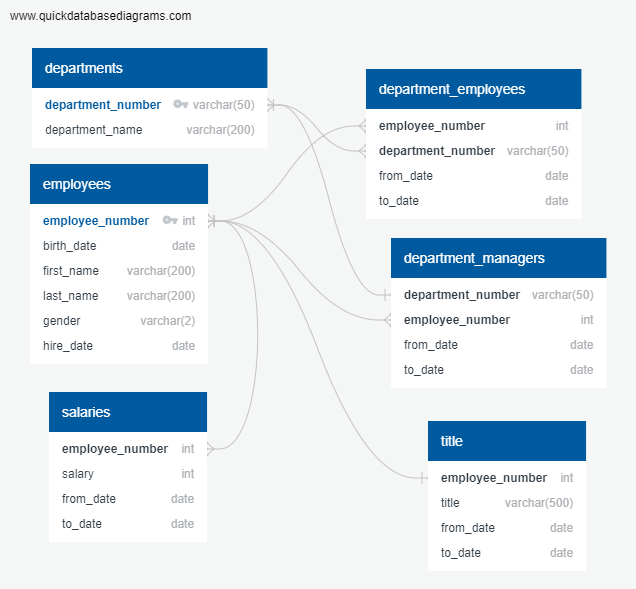

# SQL-Challenge

In this project, I designed tables to hold data in CSVs that contain employee data, imported the CSVs into a SQL database, and answered questions about the data.

## How to Run Code

1. Clone repository into a folder on your computer

2. Download Postgres

3. Create tables in Postgres corresponding to the table names in the ERD

4. Upload excel files to populate tables with data

5. Copy and paste SQL-Queries.sql from EmployeeSQL folder into a new tab in Postgres and run

#### Data Modeling

Inspected the CSVs and sketched out an ERD of the tables. I used quickdatabasediagrams to generate an ERD [http://www.quickdatabasediagrams.com](http://www.quickdatabasediagrams.com).

#### Data Engineering

* Used the information I had to create a table schema for each of the six CSV files. 

* Imported each CSV file into the corresponding SQL table.

#### Data Analysis

The following is a list of the metrics I reported upon:

1. List the following details of each employee: employee number, last name, first name, gender, and salary.

2. List employees who were hired in 1986.

3. List the manager of each department with the following information: department number, department name, the manager's employee number, last name, first name, and start and end employment dates.

4. List the department of each employee with the following information: employee number, last name, first name, and department name.

5. List all employees whose first name is "Hercules" and last names begin with "B."

6. List all employees in the Sales department, including their employee number, last name, first name, and department name.

7. List all employees in the Sales and Development departments, including their employee number, last name, first name, and department name.

8. In descending order, list the frequency count of employee last names, i.e., how many employees share each last name.

## Screenshots

Above is the ERD containing the various tables created as part of the project and the relationships between them.
